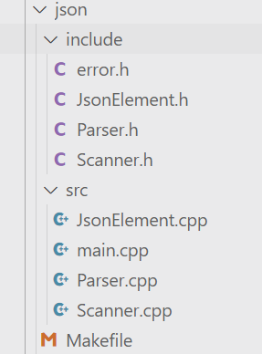

## 新的知识点

命名空间：https://www.runoob.com/cplusplus/cpp-namespaces.html

枚举类：https://www.runoob.com/w3cnote/cpp-enum-intro.html

union：https://blog.csdn.net/hou09tian/article/details/80816445

stringstream：https://blog.csdn.net/liitdar/article/details/82598039

```c++
echo "# Json-linux" >> README.md
git init
git add README.md
git commit -m "first commit"
git branch -M main
git remote add origin git@github.com:axyzstra/Json-linux.git
git push -u origin main
```

## `lunix git`

`lunix git`：https://blog.csdn.net/weixin_44966641/article/details/119791118

虚拟机使用主机代理：https://zhuanlan.zhihu.com/p/679982520

## 整体思路

json 介绍：https://www.json.org/json-zh.html

首先对于一个 `json` 字符串，包含很多元素，包括对象，数组，数字，字符串等；而每种元素是不同类型的数据类型；此处使用 `JsonElement` 来存储；其中包含两个属性，即当前元素的类型 `type` 和当前元素的值 `value`；

存储 `Json` 元素的类已经完成了。要得到这些元素，需要对整个字符串进行解析；解析是得到正确元素的过程；解析的过程中必然伴随着对字符串的扫描；因此必须由一个扫描器。

扫描器扫描到的东西无非各种特殊字符，例如 `{ [ :` 等等；将其定义为 `token`；将 `json` 拆分开来，最小的元素构成只有两类，即字符串和数字；由这两类构成所有的其他对象；例如对象 `{"age":12}`，数组 `[1, 2]`，尽管 `json` 元素包括很多，但是最基本的类型都是字符串和数字；因此扫描只得到两种结果，也只存放这两种结果，即数字和字符串。这也是扫描器所具有的属性。注意 `json` 中可能还包含 `bool`，由于 `bool` 比较简单，因此不需要特殊处理

扫描器得到最基本的两种类型，解析器需要用这两种基本类型来组成其他的一般类型。因此扫描器作为解析器的成员变量

## 源码阅读

### scanner.h

> 扫描类，包括扫描的所有动作，将扫描到的结果放在自己的属性中；

> 下面代码中为节省篇幅，不给出具体函数实现；

```c++
namespace axyz {
	namespace json {
		class Scanner {
		public:
			Scanner(std::string source) : source_(source), current_(0) {}
			enum class JsonTokenType {
				BEGIN_OBJECT,		// {
				END_OBJECT,			// }

				VALUE_SEPARATOR,		// ,
				NAME_SEPARATOR,		// :

				VALUE_STRING,		// string
				VALUE_NUMBER,		// 1,2,3

				LITERAL_TRUE,		// true
				LITERAL_FALSE,		// false
				LITERAL_NULL,		// null

				BEGIN_ARRAY,		// [
				END_ARRAY,			// ]

				END_OF_SOURCE,		// EOF

				ERROR
			};

			friend std::ostream& operator<<(std::ostream& os, 
                                            const JsonTokenType& type);

			// 从当前扫描的 token 出发寻找下一个 token
			JsonTokenType Scan();
			bool IsAtEnd();
			char Advance();
			bool IsDigit(char c);
			char Peek();
			char PeekNext();

			void ScanTrue();
			void ScanFalse();
			void ScanNull();
			void ScanString();
			void ScanNumber();

			void RollBack();

			std::string GetStringValue();
			float GetNumberValue();

		private:
			std::string source_;

			size_t prev_pos_;
			size_t current_;

			float value_number_;
			std::string value_string_;
		};
	}
}
```

#### 属性

```c++
std::string source_;		// 原始字符串
size_t prev_pos_;			// 扫描的上一个位置
size_t current_;			// 扫描的当前位置
float value_number_;		// 扫描为数字转化后存放到此
std::string value_string_;	// 扫描为字符串存放到此
```

#### 成员函数

```c++
JsonTokenType Scan();	// 扫描字符串直到遇到 token 返回，过程中移动指针
bool IsAtEnd();			// 字符串是否结束
char Advance();			// 获取当前值，并将指针向前移一位
bool IsDigit(char c);	// 是否是数字
char Peek();			// 返回当前位置的单个字符
char PeekNext();		// 返回当前位置的下一位字符


void ScanTrue();		// 扫描 True
void ScanFalse();		// 扫描 False
void ScanNull();		// 扫描 Null

// 以下函数将扫描结果放在属性中，即 value_string_ 和 value_number_
void ScanString();		// 扫描 string
void ScanNumber();		// 扫描数字

void RollBack();		// 回到上一个位置

std::string GetStringValue();	// 获取属性值
float GetNumberValue();			
```

该类友元：`friend std::ostream& operator<<(std::ostream& os, const JsonTokenType& type)`

此类将 `json` 中的特殊字符都以 `eumn` 的形式存储；即 `token` ，该函数重载 `<<` 以正确输出 `token`

### JsonElement.h

```c++
namespace axyz {
	namespace json {
		class JsonElement;
		using JsonObject = std::unordered_map<std::string, JsonElement*>;
		using JsonArray = std::vector<JsonElement*>;

		// 基本的json类型
		class JsonElement {
		public:
			// 主要是为了记录当前 json 的类型
			enum class Type {
				JSON_OBJECT,
				JSON_ARRAY,
				JSON_STRING,
				JSON_NUMBER,
				JSON_BOOL,
				JSON_NULL
			};

			// Json 的 Value, union 只能有一个成员有真实值
			union Value {
				JsonObject* value_object;
				JsonArray* value_array;

				std::string* value_string;
				float value_number;
				bool value_bool;
			};

			// 构造方法
			JsonElement() : type_(Type::JSON_NULL) {}
			JsonElement(JsonObject* value_object) : 
            type_(Type::JSON_OBJECT) { value(value_object); }
			JsonElement(JsonArray* value_array) : 
            type_(Type::JSON_ARRAY) { value(value_array); }
			JsonElement(std::string* value_string) : 
            type_(Type::JSON_STRING) { value(value_string); }
			JsonElement(float value_number) : 
            type_(Type::JSON_NUMBER) { value(value_number); }
			JsonElement(bool value_bool) : 
            type_(Type::JSON_BOOL) { value(value_bool); }

			~JsonElement();

			Type type() { return type_; }
			Value value() { return value_; }

			// 向下转型的方法
			JsonObject* AsObject();
			JsonArray* AsArray();
			std::string* AsString();
			float AsNumber();
			bool AsBool();

			// 转为 json 字符串
			std::string Dumps();
            
			friend std::ostream& operator<<(std::ostream& os, 
                                            const JsonObject& object);
			friend std::ostream& operator<<(std::ostream& os, 
                                            const JsonArray& array);
			friend std::ostream& operator<<(std::ostream& os, 
                                            const JsonElement::Type& type);
			friend std::ostream& operator<<(std::ostream& os, 
                                            const JsonElement::Value& value);

			void value(JsonObject* value);
			void value(JsonArray* value);
			void value(std::string* value);
			void value(float value);
			void value(bool value);

		private:
			Type type_;
			Value value_;
		};
	}
}

```

#### 重要写法

```c++
enum class Type {...};
union Value {...};
```

注意此处的 `union` 类型；其中的成员使用指针类型有利于提升空间效率；

注意其中的 `string` 必须使用指针形式；否则在编写默认构造函数时容易出现问题；

> 如果 `value_string` 不是指针类型，而是直接存储 `std::string` 对象（如 `std::string value_string;`），情况就不同了。非静态内置类型或用户定义类型的成员变量在类对象构造时，如果没有提供初始值或在构造函数中进行初始化，编译器会要求对其进行值初始化。对于 `std::string` 这样的类类型，未初始化会导致未定义的行为，因为它们可能含有复杂的内部状态（如动态分配的内存）需要正确设置。因此，如果 `value_string` 是非指针类型且在构造函数中没有对其进行初始化，编译器会报错，提示需要初始化该成员变量。

通俗来说，下面罗列了 `Value` 可以存储的其他类型，但是只能存储罗列类型中的一种；

```c++
using JsonObject = std::unordered_map<std::string, JsonElement*>;
using JsonArray = std::vector<JsonElement*>;
```

==注意上面容器中存放的内容为指针而不是具体的类；==

注意 `Json` 中的对象是一个递归的过程；例如：

```json
{
    "addr": {
        "china" : {
            "guangdong" : "shenzhen"
        }
    }
}
```

因此 `JsonObject` 的定义写为 `std::unordered_map<std::string, JsonElement*>`

#### 属性

```c++
Type type_;		// 当前 JsonElement 的类型
Value value_;	// 存储 JsonElement 的值
```

#### 成员函数

```c++
// 一系列构造方法和赋值方法(value) 略
JsonObject* AsObject();		// 返回 value_object
JsonArray* AsArray();
std::string* AsString();
float AsNumber();
bool AsBool();

std::string Dumps();		// 将当前 JsonElement 转化为标准的 json 字符串；
```

此处的几个 `As` 函数其实就是返回 `Value` 中存储的值；因为 `Value` 存储值的可能性有多种；因此需要在此处特殊处理；

### Parser.h

```c++
namespace axyz {
	namespace json {
		class Parser {
		public:
			// 解析得到 json 元素
			JsonElement* Parse();
			Parser(const Scanner& scanner) : scanner_(scanner) {}
		private:
			JsonObject* ParseObject();
			JsonArray* ParseArray();
		private:
			Scanner scanner_;
		};
	}
}
```

#### 属性

```c++
Scanner scanner_;	// 即包含原始字符串的扫描器；
```

#### 成员函数

```c++
JsonElement* Parse();		// 解析扫描器中扫描得到的 token 从而得到 JsonElement
```

```c++
JsonObject* ParseObject();	// Parse 中的子方法，解析得到对象
JsonArray* ParseArray();	// 解析得到数组
```

#### Parse()

```c++
JsonElement* Parser::Parse()
{
    JsonElement* element = new JsonElement();
    JsonTokenType token_type = scanner_.Scan();

    switch (token_type) {
    case JsonTokenType::BEGIN_OBJECT: {
        JsonObject* object = ParseObject();
        element->value(object);
        break;
    }
    case JsonTokenType::BEGIN_ARRAY: {
        JsonArray* array = ParseArray();
        element->value(array);
        break;
    }
    ......
    default:
        break;
    }
    //std::cout << element->type() << std::endl;
    return element;
}
```

重点解析扫描对象和数组，若遇到 `{` 或 `[`  表示遇到了对象或者数组；此时需要单独处理；

#### ParseObject()

```c++
JsonObject* Parser::ParseObject()
{
    JsonObject* res = new JsonObject();
    JsonTokenType curToken = scanner_.Scan();
	
    // 若遇到 } 则直接结束；即 {} 空对象
    if (curToken == JsonTokenType::END_OBJECT) {
        return res;
    }
    // 若不是 {}，由于 Scan 会移动指针，因此将指针回退
    // 例如 {"age": 20}，上一次扫描将返回 "，这就会导致后面扫描不是完整的 "str"，因此回退
    scanner_.RollBack();
    while (true)
    {
        curToken = scanner_.Scan();
        // { 结束后必须是字符串开始 "
        if (curToken != JsonTokenType::VALUE_STRING) {
            Error("Key must be string");
        }
        // 遇到 " 则扫描得到完整的 string 作为当前对象的 key 值
        // 扫描时已经将 string 存放到 value_ 中了获取即可，此时指针在 "(end) 上
        std::string key = scanner_.GetStringValue();
        // 此时指针在 "(end) 上，因此再向前一位
        curToken = scanner_.Scan();
        // 字符串结束后必须是 : 
        if (curToken != JsonTokenType::NAME_SEPARATOR) {
            Error("Expected ':' in object!");
        }
        // 上面已经读取了 {"age":20} 的 ‘:’ 接下来继续读取
        (*res)[key] = Parse();
        curToken = scanner_.Scan();
        if (curToken == JsonTokenType::END_OBJECT) {
            break;
        }
        if (curToken != JsonTokenType::VALUE_SEPARATOR) {
            Error("Expected ',' in object!");
        }
    }
    return res;
}
```

#### ParseArray()

> 和 Object 的解析过程类似！

```c++
JsonArray* Parser::ParseArray()
{
    JsonArray* res = new JsonArray();
    JsonTokenType curToken = scanner_.Scan();
    if (curToken == JsonTokenType::END_ARRAY) {
        return res;
    }
    scanner_.RollBack();

    while (true) {
        res->push_back(Parse());
        curToken = scanner_.Scan();
        if (curToken == JsonTokenType::END_ARRAY) {
            break;
        }
        if (curToken != JsonTokenType::VALUE_SEPARATOR) {
            Error("Expected ',' in array");
        }
    }
    return res;
}
```

## 自己实现中遇到的问题

### 重定义和未定义

> 即：`multiple definition` 和 `undefined reference`

最开始 `Error` 函数 在`Error.h` 中实现且没有加上防卫式声明；这导致错误：`multiple definition`；在头文件中加上防卫式声明，并将其具体实现放在 `.cpp` 文件中可以解决该问题；

```c++
#ifndef _ERROR_
#define _ERROR_
...
#endif
```


若成员函数使用 `inline`，最终编译时却导致了该函数 `undefined reference`；


以上两个问题的原因：https://blog.csdn.net/gw569453350game/article/details/77934568

> - 如果将函数的实现放在头文件中，那么每一个包含该头文件的cpp文件都将得到一份关于该函数的定义，那么链接器会报函数重定义错误。
> - 如果将函数的实现放在头文件，并且标记为 inline 那么每一个包含该头文件的cpp文件都将得到一份关于该函数的定义，并且链接器不会报错。
> - 如果将函数的实现放在cpp文件中，并且没有标记为inline,那么该函数可以被连接到其他编译单元中。
> - 如果将函数的实现放在cpp文件中，并且标记为inline, 那么该函数对其他编译单元不可见（类似static的效果），也就是其他cpp文件不能链接该函数库，这就是标题中出现的 … undefined reference to …
>   问题原因就是，编译器在编译一个inline函数时，需要知道其完整定义，如果编译器在本编译单元找不到inline函数定义就会报错（inline函数的调用不涉及到函数的call，也就不需要链接器参与进来工作，所以也就不会去其他编译单元查找函数定义）。

总结：头文件不要定义函数，否则会导致 `multiple definition`；标记为 `inline ` 可以避免；

在 `.cpp` 文件中标记为 `inline` 会导致 `undefined reference`；

## 使用 gdb 定位段错误

> 一般的调试方法

现有 main.cpp 

```cpp
#include <iostream>
#include <sstream>
#include "Parser.h"
#include "Scanner.h"
#include "JsonElement.h"

using JsonObject = std::unordered_map<std::string, axyz::json::JsonElement*>;

int main() {
    std::string jsonStr = R"({
        "name":"John", 
        "age":30, 
        "isStudent":true, 
        "scores":[90, 95, 88], 
        "address":{
             "city":"New York", 
             "country":"USA"
         }
    })";


    axyz::json::Scanner scanner(jsonStr);
    axyz::json::Parser parser(scanner);
    axyz::json::JsonElement* root = parser.Parse();
    
    if (root != nullptr) {
        std::cout << "Parsed JSON Element:\n";
        JsonObject* tmp = root->AsObject();
        std::cout << tmp << std::endl;
        std::cout << (*tmp).begin()->first << std::endl;
        std::cout << *tmp << std::endl;
        delete root;
        root = nullptr;
    }
    else {
        std::cerr << "Failed to parse JSON string!" << std::endl;
    }

    return 0;
}
```

执行程序报错

```shell
axyz@axyz-virtual-machine:~/Desktop/Project/json$ make
g++ -I include -g -c src/main.cpp -o src/main.o
g++ -I include -g -c src/Parser.cpp -o src/Parser.o
g++ -I include -g -c src/JsonElement.cpp -o src/JsonElement.o
g++ -I include -g -c src/Scanner.cpp -o src/Scanner.o
g++ -o main src/main.o src/Parser.o src/JsonElement.o src/Scanner.o
axyz@axyz-virtual-machine:~/Desktop/Project/json$ ./main
Parsed JSON Element:
{
Segmentation fault (core dumped)
```

可见报段错误；

Debug 流程：注意编译时的 `-g` 参数

### 进入调试模式 

```shell
gdb main
```

### 打断点

在可能出现错误的地方打断点，此处是在调用函数处最容易出现错误。于是在函数开始时打断点；

```cpp
axyz::json::Scanner scanner(jsonStr);
axyz::json::Parser parser(scanner);
axyz::json::JsonElement* root = parser.Parse();
```

main 文件 22 行，于是：

```shell
(gdb) b 22
Breakpoint 1 at 0x2743: file src/main.cpp, line 22.
(gdb) i b
Num     Type           Disp Enb Address            What
1       breakpoint     keep y   0x0000000000002743 in main() at src/main.cpp:22
```

### 启动程序

启动程序；让其停在断点处；

```shell
(gdb) run
Starting program: /home/axyz/Desktop/Project/json/main 

Breakpoint 1, main () at src/main.cpp:22
22          axyz::json::Scanner scanner(jsonStr);
(gdb) 
```

### 单步执行

单步执行，首先使用 `n` 单步不进入函数，找到到底是哪个函数出问题了；

```shell
(gdb) n
23          axyz::json::Parser parser(scanner);
(gdb) n
24          axyz::json::JsonElement* root = parser.Parse();
(gdb) n
26          if (root != nullptr) {
(gdb) n
27              std::cout << "Parsed JSON Element:\n";
(gdb) n
Parsed JSON Element:
28              JsonObject* tmp = root->AsObject();
(gdb) n
29              std::cout << tmp << std::endl;
(gdb) n
0x555555574170
30              std::cout << (*tmp).begin()->first << std::endl;
(gdb) 
scores
31              std::cout << *tmp << std::endl;
(gdb) n
{

Program received signal SIGSEGV, Segmentation fault.
0x00005555555570dc in std::__detail::_Hash_node<std::pair<std::__cxx11::basic_string<char, std::char_traits<char>, std::allocator<char> > const, axyz::json::JsonElement*>, true>::_M_next (
    this=0x0) at /usr/include/c++/9/bits/hashtable_policy.h:270
270           { return static_cast<_Hash_node*>(this->_M_nxt); }
```

可见，段除外可能发生在第 31 行。重新调试，31 行中包含 `<<` 的重载；下次使用 `s` 进入该函数；

### 重新调试

重新进行调试，在 31 行断点，运行至 31 行；

```shell
(gdb) i b
Num     Type           Disp Enb Address            What
1       breakpoint     keep y   0x000000000000284f in main() at src/main.cpp:31
(gdb) run
Starting program: /home/axyz/Desktop/Project/json/main 
Parsed JSON Element:
0x555555574170
scores

Breakpoint 1, main () at src/main.cpp:31
31              std::cout << *tmp << std::endl;
(gdb) 
```

### 进入函数

使用 `s` 单步进入 `<<` 重载函数；

```shell
(gdb) s
axyz::json::operator<< (os=..., 
    object=<error reading variable: Cannot access memory at address 0x22>)
    at src/JsonElement.cpp:97
97              std::ostream& operator<<(std::ostream& os, const JsonObject& object) {
```

### 单步调试

进入函数后使用单步调试 `n`；

```shell
(gdb) n
98                  os << "{\n\t";
(gdb) n
{
99                  auto end_iter = object.end(); // 先保存 end() 返回的迭代器
(gdb) n
100                 for (auto iter = object.begin(); iter != end_iter; iter++) {
(gdb) n
101                     os << '\"' << iter->first << '\"' << " : " << iter->second->Dumps();
(gdb) n
102                     if (iter != std::prev(end_iter)) { // 使用 std::prev 获取前一个元素的迭代器
(gdb) n

Program received signal SIGSEGV, Segmentation fault.
0x00005555555570dc in std::__detail::_Hash_node<std::pair<std::__cxx11::basic_string<char, std::char_traits<char>, std::allocator<char> > const, axyz::json::JsonElement*>, true>::_M_next (
    this=0x0) at /usr/include/c++/9/bits/hashtable_policy.h:270
270           { return static_cast<_Hash_node*>(this->_M_nxt); }
```

可见，程序错误发生在当前文件的第 102 行；102 行的代码即下面第一行；

```cpp
if (iter != std::prev(end_iter)) { // 使用 std::prev 获取前一个元素的迭代器
	os << ", \n\t";
}
```

到此定位到了具体的错误，即 `end_iter` 为空导致的错误；查看 `end_iter` 来源为 `auto end_iter = object.end();` 因此修改该重载函数；

### 修改函数

修改函数为：

```cpp
std::ostream& operator<<(std::ostream& os, const JsonObject& object) {
            os << "{\n\t";
            
            size_t size = object.size();
            
            int index = 0;
            
            for (auto iter = object.begin(); iter != object.end(); iter++) {
                os << '\"' << iter->first << '\"' << " : " << iter->second->Dumps();
                if (index != size) {
                    os << ", \n\t";
                }
                index++;
            }
            os << "\n}";
            return os;
        }
```

### 重新执行

```bash
axyz@axyz-virtual-machine:~/Desktop/Project/json$ make
g++ -I include -g -c src/JsonElement.cpp -o src/JsonElement.o
g++ -o main src/main.o src/Parser.o src/JsonElement.o src/Scanner.o
axyz@axyz-virtual-machine:~/Desktop/Project/json$ ./main
Parsed JSON Element:
0x55e51fdd5170
scores
{
        "scores" : [90, 95, 88], 
        "isStudent" : true, 
        "age" : 30, 
        "address" : {
        "country" : "USA", 
        "city" : "New York", 

}, 
        "name" : "John", 

}
```

可见，程序正常运行！

## gdb 更简洁的调试方法

[参考链接](https://blog.csdn.net/tekenuo/article/details/88394780#:~:text=%E5%9C%A8gdb%E6%8F%90%E7%A4%BA%E5%91%BD%E4%BB%A4%E7%AC%A6%E5%8F%B7%E5%90%8E%EF%BC%8C%E8%BE%93%E5%85%A5run%E5%91%BD%E4%BB%A4%EF%BC%8C%E6%89%A7%E8%A1%8C%E5%B7%B2%E7%BB%8F%E8%A3%85%E8%BD%BD%E7%9A%84gdb_test%E6%96%87%E4%BB%B6%EF%BC%8C%E5%8F%AF%E7%9C%8B%E5%88%B0%E5%B4%A9%E6%BA%83%E7%9A%84%E6%8F%90%E7%A4%BA%E4%BF%A1%E6%81%AF%E3%80%82%20%E8%BF%99%E4%B8%AA%E7%A8%8B%E5%BA%8F%E6%AF%94%E8%BE%83%E7%AE%80%E5%8D%95%EF%BC%8C%E5%B4%A9%E6%BA%83%E7%9A%84%E4%BF%A1%E6%81%AF%E4%B8%AD%E5%B7%B2%E7%BB%8F%E7%9B%B4%E6%8E%A5%E8%AF%B4%E6%98%8E%E5%9C%A8%E5%93%AA%E4%B8%AA%E6%96%87%E4%BB%B6%E7%9A%84%E5%93%AA%E4%B8%80%E8%A1%8C%E3%80%82%20%E5%A6%82%E6%9E%9C%E8%BF%98%E6%98%AF%E6%97%A0%E6%B3%95%E5%AE%9A%E4%BD%8D%EF%BC%8C%E6%8E%A5%E7%9D%80%E5%BE%80%E4%B8%8B%E7%9C%8B%EF%BC%9A,%E5%9B%BE3%203%29.%20%E8%BE%93%E5%85%A5where%20%E5%91%BD%E4%BB%A4%EF%BC%8C%E6%9F%A5%E7%9C%8B%E7%A8%8B%E5%BA%8F%E5%8F%AF%E8%83%BD%E5%87%BA%E9%94%99%E7%9A%84%E5%9C%B0%E6%96%B9%E3%80%82)

```bash
gdb main
run
```

显示段错误后：

```bash
where
```

结果：

```bash
#0  0x00005555555570dc in std::__detail::_Hash_node<std::pair<std::__cxx11::basic_string<char, std::char_traits<char>, std::allocator<char> > const, axyz::json::JsonElement*>, true>::_M_next (this=0x0) at /usr/include/c++/9/bits/hashtable_policy.h:270
#1  0x000055555555ad71 in std::__detail::_Node_iterator_base<std::pair<std::__cxx11::basic_string<char, std::char_traits<char>, std::allocator<char> > const, axyz::json::JsonElement*>, true>::_M_incr (this=0x7fffffffdca8) at /usr/include/c++/9/bits/hashtable_policy.h:299
#2  0x000055555555ae6c in std::__detail::_Node_const_iterator<std::pair<std::__cxx11::basic_string<char, std::char_traits<char>, std::allocator<char> > const, axyz::json::JsonElement*>, false, true>::operator++ (this=0x7fffffffdca8) at /usr/include/c++/9/bits/hashtable_policy.h:406
#3  0x000055555555ae4a in std::__advance<std::__detail::_Node_const_iterator<std::pair<std::__cxx11::basic_string<char, std::char_traits<char>, std::allocator<char> > const, axyz::json::JsonElement*>, false, true>, long> (__i=..., __n=-2)
    at /usr/include/c++/9/bits/stl_iterator_base_funcs.h:153
#4  0x000055555555adc5 in std::advance<std::__detail::_Node_const_iterator<std::pair<std::__cxx11::basic_string<char, std::char_traits<char>, std::allocator<char> > const, axyz::json::JsonElement*>, false, true>, long> (__i=..., __n=-1)
    at /usr/include/c++/9/bits/stl_iterator_base_funcs.h:206
#5  0x000055555555ac86 in std::prev<std::__detail::_Node_const_iterator<std::pair<std::__cxx11::basic_string<char, std::char_traits<char>, std::allocator<char> > const, axyz::json::JsonEleme--Type <RET> for more, q to quit, c to continue without paging--c
nt*>, false, true> > (__x=..., __n=1) at /usr/include/c++/9/bits/stl_iterator_base_funcs.h:230
#6  0x000055555555a727 in axyz::json::operator<< (os=..., object=std::unordered_map with 5 elements = {...}) at src/JsonElement.cpp:102
#7  0x0000555555556865 in main () at src/main.cpp:31
```

可见，直接定位到 `main.cpp:31`

然后在此处断点单步调试即可；


## core 定位段错误

使用 core，更快定位段错误的方法；https://zhuanlan.zhihu.com/p/672622266

https://blog.csdn.net/xja31415/article/details/52777509

若无 `core` 文件产生：https://blog.csdn.net/tomwillow/article/details/124370398

### 查看 core 文件空间

```bash
ulimit -c
```

```bash
ulimit -c 10240
// or
ulimit -c unlimited
```

此后重新运行可执行文件可以得到文件夹 `core`；

```bash
axyz@axyz-virtual-machine:~/Desktop/Project/json$ ulimit -c
0
axyz@axyz-virtual-machine:~/Desktop/Project/json$ ulimit -c unlimited
axyz@axyz-virtual-machine:~/Desktop/Project/json$ make
g++ -I include -g -c src/main.cpp -o src/main.o
g++ -I include -g -c src/Parser.cpp -o src/Parser.o
g++ -I include -g -c src/JsonElement.cpp -o src/JsonElement.o
g++ -I include -g -c src/Scanner.cpp -o src/Scanner.o
g++ -o main src/main.o src/Parser.o src/JsonElement.o src/Scanner.o
axyz@axyz-virtual-machine:~/Desktop/Project/json$ ./main
Parsed JSON Element:
0x55b0e3e74170
scores
{
Segmentation fault (core dumped)
axyz@axyz-virtual-machine:~/Desktop/Project/json$ ls
core  include  main  Makefile  src
```

可见，产生了文件 `core`；

```bash
gdb main core
Reading symbols from main...
[New LWP 100726]
Core was generated by `./main'.
Program terminated with signal SIGSEGV, Segmentation fault.
#0  0x000055b0e213a0dc in std::__detail::_Hash_node<std::pair<std::__cxx11::basic_string<char, --Type <RET> for more, q to quit, c to continue without paging--c
std::char_traits<char>, std::allocator<char> > const, axyz::json::JsonElement*>, true>::_M_next (this=0x0) at /usr/include/c++/9/bits/hashtable_policy.h:270
270           { return static_cast<_Hash_node*>(this->_M_nxt); }
```

可以看到错误的具体位置，此处的错误位置发生在系统函数中，要找到自己代码中进入该错误的位置，还是需要用传统的调试方法。

## 打包为静态库

[参考链接](https://subingwen.cn/linux/library/)

### 文件结构



### 生成 .o 文件

> 将所有的 .cpp 文件（主要是指对头文件实现的 .cpp 文件）生成 .o 文件

在该项目的 Makefile 中做到了这件事，因此 make 即可；

```bash
axyz@axyz-virtual-machine:~/Desktop/vscode/json$ make
g++ -I include -g -c src/main.cpp -o src/main.o
g++ -I include -g -c src/Parser.cpp -o src/Parser.o
g++ -I include -g -c src/JsonElement.cpp -o src/JsonElement.o
g++ -I include -g -c src/Scanner.cpp -o src/Scanner.o
g++ -o main src/main.o src/Parser.o src/JsonElement.o src/Scanner.o
axyz@axyz-virtual-machine:~/Desktop/vscode/json$ cd src
axyz@axyz-virtual-machine:~/Desktop/vscode/json/src$ tree
.
├── JsonElement.cpp
├── JsonElement.o
├── main.cpp
├── main.o
├── Parser.cpp
├── Parser.o
├── Scanner.cpp
└── Scanner.o

0 directories, 8 files
```

可见，所有的 .cpp 都变成了 .o 文件，删除 `main.o` 这是不需要的；

### 制作静态库

```bash
ar rcs libjson.a *.o
```

```bash
axyz@axyz-virtual-machine:~/Desktop/vscode/json/src$ ls
JsonElement.cpp  libjson.a  Parser.cpp  Scanner.cpp
JsonElement.o    main.cpp   Parser.o    Scanner.o
```

可以看到 `libjson.a`，此时静态库已经制作完毕；

### 使用静态库

需要提供头文件和静态库：

一般来说，可以不提供所有的头文件，只提供暴露的接口相关的头文件即可；此处未能实践；

```bash
axyz@axyz-virtual-machine:~/Desktop/vscode/test$ tree
.
├── include
│   ├── error.h
│   ├── JsonElement.h
│   ├── Parser.h
│   └── Scanner.h
├── libjson.a
├── main.cpp
└── Makefile

1 directory, 7 files
```

> 使用时的参数：
>
> ​	-L:  指定库所在的目录(相对或者绝对路径)
> ​	-l:  指定库的名字, 需要掐头(lib)去尾(.a) 剩下的才是需要的静态库的名字

```bash
axyz@axyz-virtual-machine:~/Desktop/vscode/test$ g++ -I include  main.cpp -o main -L ./ -l json
axyz@axyz-virtual-machine:~/Desktop/vscode/test$ ./main
Parsed JSON Element:
0x5562241a6170
scores
{
        "scores" : [90, 95, 88], 
        "isStudent" : true, 
        "age" : 30, 
        "address" : {
        "country" : "USA", 
        "city" : "New York", 

}, 
        "name" : "John", 

}
```

可见程序正常运行；

## 打包为动态库

### 文件结构

```bash
axyz@axyz-virtual-machine:~/Desktop/vscode/json$ tree
.
├── include
│   ├── error.h
│   ├── JsonElement.h
│   ├── Parser.h
│   └── Scanner.h
├── Makefile
└── src
    ├── JsonElement.cpp
    ├── main.cpp
    ├── Parser.cpp
    └── Scanner.cpp

2 directories, 9 files
```

### 生成 .o 文件

注意若需要打包为动态库，在编译时，必须使用参数 `-fpic`；

修改 makefile 文件后，make

```bash
axyz@axyz-virtual-machine:~/Desktop/vscode/json$ make
g++ -I include -fpic -g -c src/main.cpp -o src/main.o
g++ -I include -fpic -g -c src/Parser.cpp -o src/Parser.o
g++ -I include -fpic -g -c src/JsonElement.cpp -o src/JsonElement.o
g++ -I include -fpic -g -c src/Scanner.cpp -o src/Scanner.o
g++ -o main src/main.o src/Parser.o src/JsonElement.o src/Scanner.o
```

### 制作动态库

`g++ -shared *.o -o libjson.so`

```bash
axyz@axyz-virtual-machine:~/Desktop/vscode/json/src$ g++ -shared *.o -o libjson.so
axyz@axyz-virtual-machine:~/Desktop/vscode/json/src$ tree
.
├── JsonElement.cpp
├── JsonElement.o
├── libjson.so
├── main.cpp
├── Parser.cpp
├── Parser.o
├── Scanner.cpp
└── Scanner.o

0 directories, 8 files
```

可以看到，`libjson.so` 即为动态库；

### 动态库的使用

准备好文件

```bash
axyz@axyz-virtual-machine:~/Desktop/vscode/test$ tree
.
├── include
│   ├── error.h
│   ├── JsonElement.h
│   ├── Parser.h
│   └── Scanner.h
├── libjson.so
└── main.cpp

1 directory, 6 files
```

执行：

`g++ main.cpp -o main -I include -L ./ -l json` 

和静态库一样，但是：

```bash
axyz@axyz-virtual-machine:~/Desktop/vscode/test$ ./main
./main: error while loading shared libraries: libjson.so: cannot open shared object file: No such file or directory
```

执行时报错，即找不到动态库；

### 动态库加载方式

和静态库不同，动态库只有在遇到了相关的函数才会去链接动态库；若 main 函数中没有使用动态库中的函数，就不会出现上面的错误，即“找不到动态库”；

#### 动态链接器

> 动态链接器是一个独立于应用程序的进程, 属于操作系统, 当用户的程序需要加载动态库的时候动态连接器就开始工作了，很显然动态连接器根本就不知道用户通过  g++  编译程序的时候通过参数 -L 指定的路径。

那么动态链接器是如何搜索某一个动态库的呢，在它内部有一个默认的搜索顺序，按照优先级从高到低的顺序分别是：

- 可执行文件内部的 DT_RPATH 段

- 系统的环境变量 LD_LIBRARY_PATH

- 系统动态库的缓存文件 /etc/ld.so.cache

- 存储动态库/静态库的系统目录 /lib/, /usr/lib等

按照以上四个顺序, 依次搜索, 找到之后结束遍历, 最终还是没找到, 动态连接器就会提示动态库找不到的错误信息。

### 运行

[参考链接](https://blog.csdn.net/song_lee/article/details/104948691)

> 根据上面的动态链接器加载顺序，其中一种解决方案是在运行程序时在最前面加上动态库所在目录；即 `LD_LIBRARY_PATH=./ ./main`；即可正常运行；

```bash
axyz@axyz-virtual-machine:~/Desktop/vscode/test$ LD_LIBRARY_PATH=./ ./main
Parsed JSON Element:
0x555768f9f170
scores
{
        "scores" : [90, 95, 88], 
        "isStudent" : true, 
        "age" : 30, 
        "address" : {
        "country" : "USA", 
        "city" : "New York", 

}, 
        "name" : "John", 

}
```

